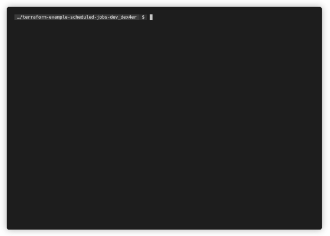

# tf

[](https://github.com/dex4er/tf)
[](https://github.com/dex4er/tf/actions/workflows/ci.yaml)
[](https://github.com/dex4er/tf/actions/workflows/lint.yaml)

Less verbose and more shell friendly Terraform.

Better this:



than this:


The original Terraform is abusively oververbosed. The `tf` bash script is a
simple wrapper which makes Terraform more CLI friendly:

- removes unecessary output
- adds own progress indicator
- provides extra compact mode
- allows to use multiple arguments when original command don't support it
- adds automatically quotes for indexed resources
- generates log file when `TF_LOG_FILE` environment variable is used

## Install

```sh
curl https://raw.githubusercontent.com/dex4er/tf/main/tf.sh | sudo tee /usr/local/bin/tf
chmod +x /usr/local/bin/tf
```

## Usage

```sh
tf init
tf plan
tf apply
tf list
tf show
```

etc...

You can combine commands, ie.:

```sh
tf apply $(tf list | grep aws_vpc)
tf list | grep data.aws_region.current | xargs tf refresh
tf list | grep random_password | xargs tf rm
tf list | grep aws_subnet | xargs tf show
tf list | grep module.one | while read r; do echo tf mv $r ${r/module.one./module.two.}; done | bash -x
```

It is recommended to use `$()` rather than `xargs` for `tf apply` or `tf destroy` because these commands are interactive.

For not recognized commands `tf` passes all arguments to `terraform` command.

### `tf apply`

The same as `terraform apply` with less verbose output.

Instead of Reading/Creating/Destroying... messages it will show a short progress
indicator.

It will skip `(known after apply)` lines from the output.

An additional option is `-compact` which will skip the content of the resources
completely.

The command accepts resource name as an argument without `-target=` option. If
argument misses quotes inside square brackets then they will be added.

The command will generate temporarily the `terraform.tfplan` file.

The command will log to the file named in `TF_LOG_FILE` environment variable.
The file name is solved by `date` command for `%` sequences.

### `tf destroy`

The same as `terraform destroy` with less verbose output.

Instead of Reading/Creating/Destroying... messages it will show a short progress
indicator.

It will skip `(known after apply)` lines from the output.

An additional option is `-compact` which will skip the content of the resources
completely.

The command accepts resource name as an argument without `-target=` option. If
argument misses quotes inside square brackets then they will be added.

The command will generate temporarily the `terraform.tfplan` file.

The command will log to the file named in `TF_LOG_FILE` environment variable.
The file name is solved by `date` command for `%` sequences.

### `tf import`

The same as `terraform import` with better handling of arguments.

If the first argument misses quotes inside square brackets then they will be
added.

The command concatenatest second and rest arguments into one.

### `tf init`

The same as `terraform init -upgrade` with less verbose output.

The command will log to the file named in `TF_LOG_FILE` environment variable.
The file name is solved by `date` command for `%` sequences.

### `tf list`

The same as `terraform state list` with less verbose output and ANSI stripped.

If argument misses quotes inside square brackets then they will be added.

### `tf mv`

The same as `terraform state mv` with less verbose output.

If argument misses quotes inside square brackets then they will be added.

### `tf plan`

The same as `terraform plan` with less verbose output.

Instead of Reading... messages it will show a short progress indicator.

It will skip `(known after apply)` lines from the output.

An additional option is `-compact` which will skip the content of the resources
completely.

The command accepts resource name as an argument without `-target=` option. If
argument misses quotes inside square brackets then they will be added.

The command will log to the file named in `TF_LOG_FILE` environment variable.
The file name is solved by `date` command for `%` sequences.

### `tf refresh`

The same as `terraform apply -refresh-only` with less verbose output.

The command accepts resource name as an argument without `-target=` option. If
argument misses quotes inside square brackets then they will be added.

The command will log to the file named in `TF_LOG_FILE` environment variable.
The file name is solved by `date` command for `%` sequences.

### `tf rm`

The same as `terraform state rm` with less verbose output.

The command accepts multiple arguments. If argument misses quotes inside square
brackets then they will be added.

### `tf show`

The same as `terraform show` and `terraform state show` with less verbose output
and ANSI stripped.

`terraform show` is used when the command is run without arguments and
`terraform state show` when arguments are used.

The command accepts multiple arguments. If argument misses quotes inside square
brackets then they will be added.

### `tf taint`

The same as `terraform taint` and it accepts multiple arguments. If argument
misses quotes inside square brackets then they will be added.

### `tf untaint`

The same as `terraform untaint` and it accepts multiple arguments. If argument
misses quotes inside square brackets then they will be added.

### License

Copyright (c) 2020-2022 Piotr Roszatycki <piotr.roszatycki@gmail.com>

[MIT](https://opensource.org/licenses/MIT)
