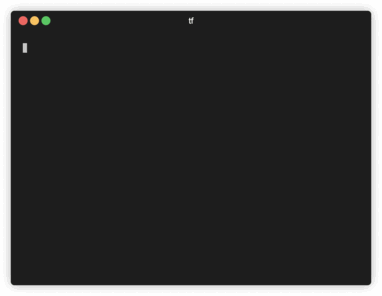
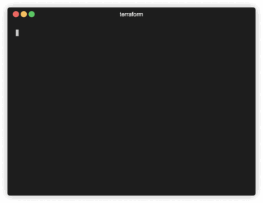

# tf

[](https://github.com/dex4er/tf)
[](https://github.com/dex4er/tf/actions/workflows/snapshot.yaml)
[](https://github.com/dex4er/tf/actions/workflows/release.yaml)
[](https://github.com/dex4er/tf/actions/workflows/trunk.yaml)

Less verbose and more shell-friendly Terraform.

| Better this:                                               | Than this:                                                             |
| ---------------------------------------------------------- | ---------------------------------------------------------------------- |
| [](assets/tf.gif) | [](assets/terraform.gif) |

The original Terraform is abusively oververbosed. The `tf` wrapper makes
Terraform more CLI-friendly:

- removes unnecessary output
- adds own colored progress indicator
- provides an extra compact mode
- allows to use of multiple arguments when original command doesn't support it
- adds automatically quotes for indexed resources (`xargs` friendly)
- generates a log file when `TF_OUTPUT_PATH` environment variable is used

## Install

Download from [releases](https://github.com/dex4er/tf/releases). Put anywhere
in the `$PATH`.

### asdf

Install with [asdf](https://asdf-vm.com/):

```shell
asdf plugin-add tf https://github.com/dex4er/asdf-tf.git
asdf install tf latest
asdf global tf latest
```

### mise

Install with [mise-en-place](https://mise.jdx.dev/):

```shell
mise plugins install tf https://github.com/dex4er/asdf-tf.git
mise use -g tf@latest
```

### Homebrew

Install with [homebrew](https://brew.sh/):

```sh
brew tap dex4er/tap
brew install tf
```

### Zsh

With Zsh `noglob` should be used to prevent errors when indexed parameters
are arguments for `tf` command.

Add to `~/.zshenv`:

```sh
alias tf='noglob tf'
```

You can use re-use Oh My Zsh plugin dedicated to the original Terraform:

```sh
compdef _terraform tf
```

## Usage

```sh
tf init
tf plan
tf apply
tf list
tf show
```

etc...

You can combine commands, ie.:

```sh
tf apply $(tf list | grep aws_vpc)
tf list | grep data.aws_region.current | xargs tf refresh
tf list | grep random_password | xargs tf rm
tf list | grep aws_subnet | xargs tf show
tf list | grep module.one | while read r; do echo tf mv $r ${r/module.one./module.two.}; done | bash -x
tf list | fzf | xargs tf show | highlight -O xterm256 --syntax terraform
```

It is recommended to use `$()` rather than `xargs` for `tf apply` or `tf destroy` because these commands are interactive.

For not recognized commands `tf` passes all arguments to `terraform` command.

`terraform` command might be replaced with another using `TERRAFORM_PATH`
environment variable, ie.:

```sh
export TERRAFORM_PATH=tofu
```

### `tf apply`

The same as `terraform apply` with less verbose output.

Instead of Reading/Creating/Destroying... messages it will show a short progress
indicator.

It will skip `(known after apply)` lines from the `-short` mode output. Also
it will hide a plan for data sources (`data.xxx will be read during apply`
blocks) from the `-short` and `-compact` mode output.

Additional options can be used: `-counters` shows counters with processed
resources, `-compact` skips the content of the resources, `-short` removes
unecessary lines (default), `-full` keeps original manifest, `-fan` hides
messages about progress and shows short indicator (default), `-dots` hides
messages about progress and shows single dot or character for each line,
`-verbatim` keeps original messages about progress, `-verbose` adds counters
to original messages (default if `TF_IN_AUTOMATION=1`), `-no-outputs` hides
outputs (default, `-no-outputs=false` shows it again).

The command accepts the resource name as an argument without `-target=`
option. If the argument misses quotes inside square brackets then they will
be added.

The command will log to the file named in `TF_OUTPUT_PATH` environment
variable. The file name is resolved with `strftime`'s `%` sequences.

The variable `TF_PLAN_FORMAT` switches the default format for the plan
(compact, short, full). The variable `TF_PROGRESS_FORMAT` switches the
default format for the progress indicator (counters, fan, dots, verbose,
verbatim).

### `tf destroy`

The same as `terraform destroy` with less verbose output.

Instead of Reading/Creating/Destroying... messages it will show a short progress
indicator.

It will skip `(known after apply)` lines from the `-short` mode output. Also
it will hide a plan for data sources (`data.xxx will be read during apply`
blocks) from the `-short` and `-compact` mode output.

Additional options can be used: `-counters` shows counters with processed
resources, `-compact` skips the content of the resources, `-`short`removes
unnecessary lines (default),`-full`keeps original manifest,`-fan`hides
messages about progress and shows short indicator (default),`-dots`hides
messages about progress and shows single dot or character for each line,`-verbatim`keeps original messages about progress,`-verbose`adds counters
to original messages (default if`TF_IN_AUTOMATION=1`), `-no-outputs`hides
outputs (default,`-no-outputs=false` shows it again).

The command accepts the resource name as an argument without `-target=`
option. If the argument misses quotes inside square brackets then they will
be added.

The command will log to the file named in `TF_OUTPUT_PATH` environment
variable. The file name is resolved with `strftime`'s `%` sequences.

The variable `TF_PLAN_FORMAT` switches the default format for the plan
(compact, short, full). The variable `TF_PROGRESS_FORMAT` switches the
default format for the progress indicator (counters, fan, dots, verbose,
verbatim).

### `tf import`

The same as `terraform import` with better handling of arguments.

If the first argument misses quotes inside square brackets then they will be
added.

The command appends the third argument and more to the second with a space as
the separator.

The `tf show` for this resource is run after import unless additional option
`-no-show` has been used.

### `tf init`

The same as `terraform init` with less verbose output.

The command will log to the file named in `TF_OUTPUT_PATH` environment
variable. The file name is resolved with `strftime`'s `%` sequences.

Additional option `-codesign` causes that all providers will have replaced
existing signature and checksums will be removed from the lock file. It will
allow to run providers by Terraform on MacOS when the system blocks
applications with unrecognized signature.

### `tf list`

The same as `terraform state list` with less verbose output and ANSI stripped.

If the argument misses quotes inside square brackets then they will be added.

### `tf mv`

The same as `terraform state mv` with less verbose output.

If the argument misses quotes inside square brackets then they will be added.

### `tf plan`

The same as `terraform plan` with less verbose output.

Instead of Reading... messages it will show a short progress indicator.

It will skip `(known after apply)` lines from the `-short` mode output. Also,
it will hide a plan for data sources (`data.xxx will be read during apply`
blocks) from the `-short` and `-compact` mode output.

Additional options can be used: `-counters` shows counters with processed
resources, `-compact` skips the content of the resources, `-short` removes
unnecessary lines (default), `-full` keeps original manifest, `-fan` hides
messages about progress and shows short indicator (default), `-dots` hides
messages about progress and shows single dot or character for each line,
`-verbatim` keeps original messages about progress, `-verbose` adds counters
to original messages (default if `TF_IN_AUTOMATION=1`).

The command accepts the resource name as an argument without `-target=`
option. If the argument misses quotes inside square brackets then they will
be added.

The command will log to the file named in `TF_OUTPUT_PATH` environment
variable. The file name is resolved with `strftime`'s `%` sequences.

The variable `TF_PLAN_FORMAT` switches the default format for the plan
(compact, short, full). The variable `TF_PROGRESS_FORMAT` switches the
default format for the progress indicator (counters, fan, dots, verbose,
verbatim).

### `tf refresh`

The same as `terraform refresh` with less verbose output.

Additional options can be used: `-counters` shows counters with processed
resources, `-compact` skips the content of the resources, `-short` removes
unnecessary lines (default), `-full` keeps original manifest, `-fan` hides
messages about progress and shows short indicator (default), `-dots` hides
messages about progress and shows single dot or character for each line,
`-verbatim` keeps original messages about progress, `-verbose` adds counters
to original messages (default if `TF_IN_AUTOMATION=1`), `-no-outputs` hides
outputs (default, `-no-outputs=false` shows it again).

The command accepts resource name as an argument without `-target=` option.
If the argument misses quotes inside square brackets then they will be added.

The command will log to the file named in `TF_OUTPUT_PATH` environment
variable. The file name is resolved with `strftime`'s `%` sequences.

The variable `TF_PLAN_FORMAT` switches the default format for the plan
(compact, short, full). The variable `TF_PROGRESS_FORMAT` switches the
default format for the progress indicator (counters, fan, dots, verbose,
verbatim).

### `tf rm`

The same as `terraform state rm` with less verbose output.

The command accepts multiple arguments. If the argument misses quotes inside
square brackets then they will be added.

### `tf show`

The same as `terraform show` and `terraform state show` with less verbose output
and ANSI stripped.

`terraform show` is used when the command is run without arguments and
`terraform state show` when arguments are used.

The command accepts multiple arguments. If the argument misses quotes inside
square brackets then they will be added.

An additional option can be used: `-no-outputs` hides outputs (default,
`-no-outputs=false` shows it again).

### `tf taint`

The same as `terraform taint` and it accepts multiple arguments. If the
argument misses quotes inside square brackets then they will be added.

### `tf untaint`

The same as `terraform untaint` and it accepts multiple arguments. If the
argument misses quotes inside square brackets then they will be added.

### `tf upgrade`

The same as `terraform init -upgrade` with less verbose output.

The command will log to the file named in `TF_OUTPUT_PATH` environment
variable. The file name is resolved with `strftime`'s `%` sequences.

Additional option `-codesign` causes that all providers will have replaced
existing signature and checksums will be removed from the lock file. It will
allow to run providers by Terraform on MacOS when the system blocks
applications with unrecognized signature.

## License

Copyright (c) 2020-2024 Piotr Roszatycki <piotr.roszatycki@gmail.com>

[MIT](https://opensource.org/licenses/MIT)
